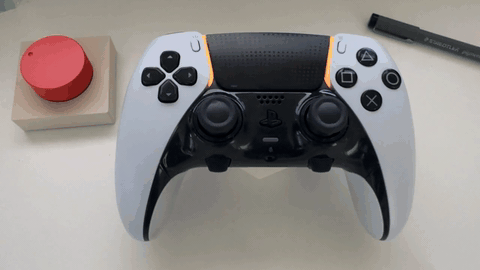
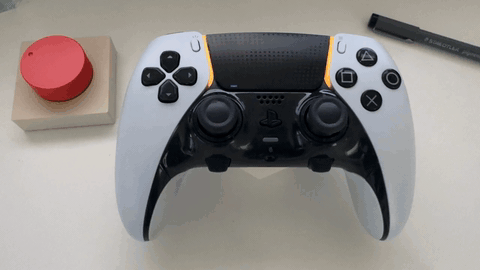
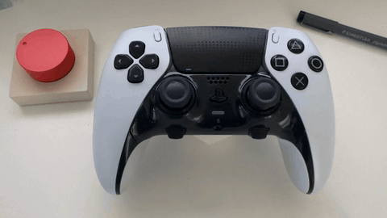
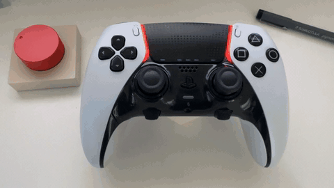

<div align="center">

# 🎮⚡ ChargeSense

**DualSense battery, finally visible on macOS.**

The percentage lives in your menu bar — and the controller itself becomes the
indicator: its lightbar paints your charge zone, its five player LEDs form a dot gauge.

[](https://github.com/0x3654/chargesense/releases)
[](https://support.apple.com/macos)
[](https://swift.org)
[](LICENSE)

[Demo](#demo) · [Features](#features) · [Install](#install) · [Build](#build-from-source) · [How it works](#how-it-works) · [Русская версия](#-русская-версия)

</div>

---

## Demo

Recorded from a real DualSense Edge over Bluetooth — the controller is the UI.

<p>
  
  
</p>

<table>
<tr>
<td width="495">(1) Discharging: green → blue → orange → red (breathing at critical), dots go out one by one</td>
<td width="495">(2) Charging: 2 s windows, yellow breath ⇄ zone color, the current dot blinks</td>
</tr>
</table>

<p>
  
  
</p>

<table>
<tr>
<td width="495">(3) Dots-only minimalism (menu toggle)</td>
<td width="495">(4) Demo show: everything at once</td>
</tr>
</table>

---

## Why

macOS never exposes a DualSense battery level — not in System Settings, not in
`system_profiler`, not in IORegistry (the HID descriptor simply has no battery usage
page). ChargeSense talks to the controller directly over HID and shows what macOS
hides.

## Features

**Menu bar**

| State | Display |
|---|---|
| On battery | `🎮 95%` |
| Charging | `⚡ 100%` |
| ≤ 20% | percentage turns red |
| Not connected | dim `🎮 —` |

Updates every 30 s and instantly on connect/disconnect. No Dock icon — menu bar only.

**Lightbar = charge zone**

| Battery | Lightbar |
|---|---|
| ≤ 15% | red, slowly breathing |
| 16–25% | red |
| 26–35% | orange |
| 36–75% | blue |
| 76%+ | green |
| charging | 2 s windows: yellow breath ⇄ zone color |

**5 player LEDs = dot gauge** — 20% per dot; while charging the current (top) dot
blinks; at full charge all five are lit.

**Charge buzz** — a short rumble the moment the cable is plugged in.

> [!NOTE]
> The controller reports charge in **10% chunks** — ChargeSense shows the bucket
> midpoint, exactly like the Linux driver does. `16%` really means "somewhere in
> 11–20%", and the number only moves when the real charge crosses the next bucket
> edge, so it can sit still for half an hour of play. Zones and dots are honest;
> the last digit is fiction.

Both controller features are menu toggles (on by default), plus a launch-at-login
toggle. The UI follows the system language: English / Русский out of the box.
Works with DualSense Edge (`054c:0df2`) and DualSense (`054c:0ce6`), Bluetooth and USB.

## Install

Grab `ChargeSense-<version>.dmg` from
[Releases](https://github.com/0x3654/chargesense/releases), open it, drag the app
to `/Applications`, launch.

> [!IMPORTANT]
> Releases are **ad-hoc signed** — there is no Apple Developer ID behind them.
> Gatekeeper will protest on first launch: right-click the app → **Open** → Open,
> or strip the quarantine bit manually:
>
>     xattr -cr /Applications/ChargeSense.app

## Build from source

```bash
./build.sh && open ChargeSense.app
```

Nothing but Xcode Command Line Tools is required.

### Releases

- locally, for testing: `scripts/release-local.sh` → `dist/ChargeSense-<ver>.dmg` + SHA-256
- on GitHub: pushing a `v*` tag triggers the workflow that builds and publishes the release

## How it works

- **Battery**: HID `GET_REPORT` — input report `0x31` (Bluetooth, 78 bytes, battery
  in byte 54) or `0x01` (USB, byte 53); over USB the value comes from the input
  report stream. Layout follows the Linux driver `hid-playstation.c`.
- **Lightbar / player LEDs**: output report `0x31` (Bluetooth, CRC32 seeded `0xA2`)
  or `0x02` (USB); `valid_flag1` bits 2 and 4, RGB at +44..46, player LED mask at
  +43 of the common block.

## Development

Run the bare binary from a terminal to see the log trace — battery parses, LED mode
switches, autostart errors:

```bash
pkill -f ChargeSense.app
./ChargeSense.app/Contents/MacOS/ChargeSense     # watch "ds5batt:" lines, Ctrl+C to stop
open ChargeSense.app                             # back to normal
```

Quirks found the hard way:

- the output report format must follow the **transport**: `0x31` with CRC32 over
  Bluetooth, `0x02` without CRC over USB. macOS happily accepts `SetReport(0x31)`
  on a USB device (returns success) — and the controller silently ignores it
- `GET_REPORT(input)` does not work over USB — read the input report stream instead
- rumble needs the `HAPTICS_SELECT` bit (`valid_flag0` BIT(1)) next to the
  vibration enable — plain DS4-style motor bytes are silently ignored
- if Bluetooth writes stop applying while reads still answer — the system game
  stack (GameOverlay / gamecontrollerd) has wedged the HID session. Power-cycling
  or re-pairing the controller does not help; reboot the Mac

## License

[MIT](LICENSE) © [0x3654](https://github.com/0x3654)

---

## 🇷🇺 Русская версия

Заряд DualSense в строке меню macOS — и на самом контроллере: цвет lightbar
показывает зону заряда, пять player-LED — шкалу точками.

macOS нигде не публикует уровень заряда DualSense — ни в System Settings, ни в
`system_profiler`, ни в IORegistry (у HID-дескриптора просто нет battery usage
page). ChargeSense общается с контроллером напрямую по HID и показывает то, что
macOS прячет.

**Меню-бар:** `🎮 95%` от батареи, `⚡` на зарядке, ≤20% — красным, без
контроллера — тусклый `🎮 —`. Обновление раз в 30 с и мгновенно при
подключении/отключении. Без иконки в доке.

**Lightbar = зона заряда:** ≤15% красный с плавным дыханием, 16–25% красный,
26–35% оранжевый, 36–75% синий, 76%+ зелёный; на зарядке — окна по 2 с: жёлтый
вздох ⇄ цвет зоны.

**5 player-LED = шкала:** по 20% на точку; при зарядке мигает текущая (верхняя)
точка, при полном заряде горят все пять.

**Жужжалка:** короткий бззз в момент подключения кабеля зарядки.

> [!NOTE]
> Контроллер отдаёт заряд **корзинами по 10%** — ChargeSense показывает середину
> корзины, ровно как драйвер Linux. `16%` на деле значит «где-то в 11–20%», число
> сдвигается только при пересечении границы корзины — может стоять полчаса игры.
> Зоны и точки честные, последняя цифра — фикция.

Обе фичи контроллера — за галками в меню (по умолчанию обе включены), там же
галка автозапуска. Язык интерфейса — по системе: английский / русский из коробки.
Поддерживаются DualSense Edge (`054c:0df2`) и обычный DualSense (`054c:0ce6`),
Bluetooth и USB.

**Установка:** `ChargeSense-<версия>.dmg` из
[Releases](https://github.com/0x3654/chargesense/releases), открыть образ,
перетащить приложение в `/Applications`, запустить.

> [!IMPORTANT]
> Релизы подписаны ad-hoc — Apple Developer ID за ними нет. Gatekeeper
> возмутится при первом запуске: правый клик по приложению → **Open** → Open либо
> снять карантин вручную:
>
>     xattr -cr /Applications/ChargeSense.app

**Сборка из исходников:** `./build.sh && open ChargeSense.app` — нужен только
Xcode Command Line Tools. Локальный тестовый релиз: `scripts/release-local.sh`
(dmg и SHA-256 в `dist/`); на GitHub тег `v*` запускает воркфлоу сборки и
публикации релиза.

**Как устроено:** батарея — HID `GET_REPORT`, input-отчёт `0x31` (Bluetooth, 78
байт, батарея в байте 54) или `0x01` (USB, байт 53), по USB — из потока отчётов;
раскладка как в драйвере Linux `hid-playstation.c`. Подсветка — output-отчёт
`0x31` (Bluetooth, CRC32 с сидом `0xA2`) или `0x02` (USB): биты 2 и 4 в
`valid_flag1`, RGB на +44..46, маска player-LED на +43 общего блока.

**Разработка и отладка:** чистый бинарник из терминала показывает лог-трассу
(парсинг батареи, смена режимов LED):

```bash
pkill -f ChargeSense.app
./ChargeSense.app/Contents/MacOS/ChargeSense     # смотреть "ds5batt:" строки, Ctrl+C
open ChargeSense.app                             # обратно к норме
```

Грабли, найденные трудным путём:

- формат output-отчёта выбирается по **транспорту**: `0x31` с CRC32 по Bluetooth,
  `0x02` без CRC по USB. macOS молча принимает `SetReport(0x31)` у USB-девайса
  (возвращает success) — а контроллер его игнорирует
- `GET_REPORT(input)` по USB не работает — читать поток input-отчётов
- вибрация требует бит `HAPTICS_SELECT` (`valid_flag0` BIT(1)) вместе с битом
  вибрации — просто DS4-совместимые байты моторов молча игнорируются
- если по Bluetooth запись перестала применяться, а чтение отвечает — системный
  игровой стек (GameOverlay / gamecontrollerd) заклинил HID-сессию: вкл/выкл и
  перепарка контроллера не помогают, лечится ребутом мака

Лицензия [MIT](LICENSE) © [0x3654](https://github.com/0x3654)
